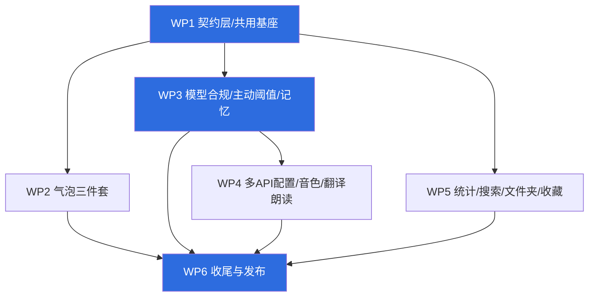
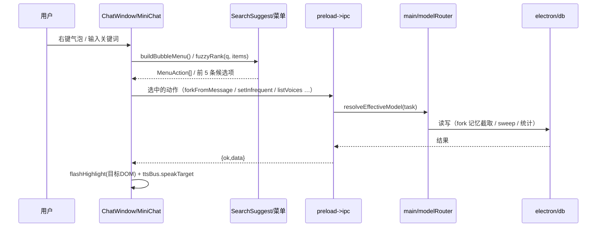

# 念语 Nianyu v2.3.94 增量批次 —— 系统设计与任务分解

> 架构：高见远 / 署名：**前方** ｜ 基线：v2.3.93 `tsc --noEmit` 零错误 ｜ 目标版本：**2.3.94**
> 原则：① 尽量不打扰用户（细节由我定夺，本文只报结论）；② 已做过的东西不重复做（复用 `forkChatFromNode` / `animControl` / `ComboBox` / `awaitingReply`）；③ 双窗同改；④ i18n 10 处全补。

---

## 1. `src/types.ts` 统一增改清单（并行开发契约・唯一命名真源）

> **写权限**：types.ts 由 **WP1 独占**。WP1 落地后如需新字段，一律提给 WP1 owner 一次性追加，禁止其他 WP 自行编辑。

### 1.1 需求 1（从此处开启新对话 + 记忆隔离）

| 类型 | 字段 | 类型 | 默认值 | 用途 |
|---|---|---|---|---|
| `AppSettings` | `chatMemoryIsolation` | `Record<string, boolean>` | `{}` | 每聊天记忆隔离覆盖，key=`"single:roleId"` / `"group:groupId"`；有效值 = `v ?? role.memoryIsolation ?? true` |
| `AppSettings` | `forkedFrom` | `Record<string, { srcKey: string; anchorMsgId: number }>` | `{}` | 记录新会话源自哪个会话/哪条消息（UI 溯源 + 迁移用） |

> 迁移/语义：`db.ts:1269 forkChatFromNode` 泛化为 `forkConversationFromAnchor(chatType, chatId, anchorMsgId, opts?)`；原剧情节点路径作为 `opts.kind='node'` 保留，**不复制记忆过滤规则**。IPC 新增 `chats:forkFromMessage(chatType, chatId, msgId)`。

### 1.2 需求 2（操作栏弹出时机）—— 无新字段

* 新增动画分组 `actionbar`（见 §4.1），`.msg-action-bar` 自 `panel` 组移入。
* 真值源：`actionBarVisible = streamed && !typing && (pseudoEnabled ? pseudoState.revealing === false : true)`。

### 1.3 需求 3（选取文字复制）—— 无新字段（`TextSelectCopyModal` 组件，见 §4）

### 1.4 需求 4（主动消息等待阈值）

| 类型 | 字段 | 类型 | 默认值 | 用途 |
|---|---|---|---|---|
| `AppSettings` | `idleAwaitReplyMax` | `number` | `1` | 达到用户回复前最多允许的未回复主动消息条数；`1..20` 有效，**`0`=无限条（不启用等待）** |
| `AppSettings` | `idleCooldownUntilReply` | `boolean` | *保留* | 【只读兼容】迁移：`true→idleAwaitReplyMax=1`，`false→0`；新逻辑只读写数值字段 |

> 运行时：`electron/awaitingReply.ts` 的 `proactiveAwaitingReply: Set<string>` → `Map<string, number>`（计数）；广播 `proactive:awaiting(true)` 的时机改为「已达上限」。

### 1.5 需求 5（所有模型调用遵守模型配置）

| 类型 | 字段 | 类型 | 默认值 | 用途 |
|---|---|---|---|---|
| `AuxTaskId`（新 union） | — | `'memory'｜'title'｜'translation'｜'moments'｜'imagePrompt'｜'videoPrompt'｜'proactive'｜'affinity'｜'summary'｜'roleComplete'｜'probe'` | — | 辅助任务标识 |
| `AppSettings` | `auxModels` | `Partial<Record<AuxTaskId, string>>` | `{}` | 任务 → modelId；缺省回填落到「该聊天的 effectiveModel」，仍无则 `defaultModel` |

### 1.6 需求 6（记忆可见性）——新增 1 项

| 类型 | 字段 | 类型 | 默认值 | 用途 |
|---|---|---|---|---|
| `AppSettings` | `autoMemRounds` | `number` | `10` | 触发一次自动提炼所需累计用户轮数（1~50 可调，替代硬编码 `AUTO_MEM_ROUNDS`） |

> 双闸门默认值**不变**（不擅自打开），只做可见性改造（方案见 §5-D3）。

### 1.7 需求 7/8/9（TTS/ASR/生图/生视频多配置 + 音色绑定 + 语速音调）

| 类型 | 字段 | 类型 | 默认值 | 用途 |
|---|---|---|---|---|
| `TtsApiProfile`（新） | `id,name,baseUrl,apiKey,model,customHeaders?` | `string` | — | 一份 TTS API 配置 |
| `AsrApiProfile`（新） | `id,name,baseUrl,apiKey,model,asrFormat?,asrLanguage?` | — | — | 一份 ASR API 配置 |
| `ImageGenProfile`（新） | `id,name,enabled,baseUrl,apiKey,model,size` | — | — | 一份生图配置（含 `enabled`，多份可各自启停） |
| `VideoGenProfile`（新） | `id,name,enabled,baseUrl,apiKey,model,duration,size` | — | — | 一份生视频配置 |
| `TtsVoiceItem`（新） | `{ id: string; name?: string; previewUrl?: string; tags?: string[] }` | — | — | 音色列表端点返回结构 |
| `AppSettings` | `ttsProfiles / ttsActiveProfileId` | `TtsApiProfile[] / string` | `[] / ''` | TTS 多配置 |
| `AppSettings` | `asrProfiles / asrActiveProfileId` | 同上 | `[] / ''` | ASR 多配置 |
| `AppSettings` | `imageGenProfiles / imageGenActiveId` | `ImageGenProfile[] / string` | `[] / ''` | 生图多配置 |
| `AppSettings` | `videoGenProfiles / videoGenActiveId` | `VideoGenProfile[] / string` | `[] / ''` | 生视频多配置 |
| `RoleTtsConfig` | `profileId?` | `string` | — | 角色绑定哪个 TTS 档案（空=当前激活档案） |
| `RoleTtsConfig` | `voiceId? / voiceName?` | `string` | — | 音色 ID（手填或列表选）/ 展示名 |
| `VoiceSettings.ttsVoices` | — | `Record<roleId, RoleTtsConfig>` | `{}` | **统一结构化**；旧「纯音色名字符串」读取时自动包装为 `{ voiceId: <旧值> }` |

> 迁移：`voice.ttsBaseUrl/ttsApiKey/ttsModel` → `ttsProfiles[0]{id:'legacy-tts'}` 并设为 active；`imageGen`/`videoGen` 同理（`'legacy-image'` / `'legacy-video'`）。旧字段保留只读，避免回滚丢配置。

### 1.8 需求 10（翻译朗读 / 防重叠）

| 类型 | 字段 | 类型 | 默认值 | 用途 |
|---|---|---|---|---|
| `TtsTargetKey`（新 alias） | — | `string` | — | `'chat:<chatKey>:<msgId>'｜'tr:src'｜'tr:dst'`，用于去重/串行/忙碌判定 |
| `SpeakRequest`（新） | `{ roleId?: string; text: string; regenerate?: boolean }` | — | — | 统一朗读入参 |
| `TtsPlayState`（新） | `'idle'｜'loading'｜'playing'｜'error'` | — | — | 按钮禁用态真源（生成中不可重复点） |

### 1.9 需求 11（统计重构）

| 类型 | 字段 | 类型 | 默认值 | 用途 |
|---|---|---|---|---|
| `AppSettings` | `favoriteRoleId` | `string｜null` | `null` | 「你最喜欢的人物」；`null`=未设置（显示加号） |
| `AppSettings` | `roleSignature` | `Record<roleId, string>` | `{}` | 人物个性签名（未写留空） |
| `AppSettings` | `roleDisplayGender` | `Record<roleId, 'male'｜'female'｜''>` | `{}` | 用户自选性别（未选留空） |
| `AppSettings` | `companionMs` | `Record<roleId, number>` | `{}` | 累计陪伴毫秒（**仅单聊前台可见时长**，5s 心跳上报） |
| `AppSettings` | `statsView` | `{ sortKey?: 'affinity'｜'companion'; rankDays?: 0 }` | `{ sortKey:'affinity' }` | 排行口径偏好（本地持久化） |
| `RoleStat` | `affinity? / companionMs?` | `number` | 补齐 | 追加可选字段（不破坏既有调用）；由 `getRoleStats()` 一并返回 |
| `TokenSlice`（新，放 `utils/tokenPie.ts`） | `{ roleId,name,tokens,ratio,colorVar,merged? }` | — | — | 饼图区块数据 |

### 1.10 需求 12/13/14（搜索铁律 / 聊天搜索 / 不常用文件夹）

| 类型 | 字段 | 类型 | 默认值 | 用途 |
|---|---|---|---|---|
| `SuggestItem`（新） | `{ id, title, sub?, kind?, score?, payload? }` | — | — | 所有搜索框候选项的统一结构 |
| `AppSettings` | `infrequentChats` | `string[]` | `[]` | 已被移入「不常用聊天文件夹」的 chatKey |
| `AppSettings` | `infrequentCfg` | `{ enabled?: boolean; idleDays?: number; lastSweepTs?: number }` | `{ enabled:true, idleDays:30 }` | `idleDays=0` 或 `enabled:false` = 永不自动移入 |
| `ChatListItem` | `isInfrequent? / lastActiveAt?` | `boolean / number` | — | UI 分组与 sweep 判定（`getChatList(includeInfrequent)`） |

### 1.11 需求 15（收尾）—— 无新字段；版本号 bump 至 **2.3.94**

---

## 2. 文件归属地图（ownership map）

| 文件 | 归属 | 多人触碰 | 规避方式 |
|---|---|---|---|
| `src/types.ts` | **WP1 独占** | 全部 | 字段清单一次性落地；后续新增走 WP1 owner 追加 |
| `src/ipc.ts` + `electron/preload.ts` | **WP1 独占** | WP2/3/4/5 | 新增 7 个通道一次到位（见 §4.2），其他 WP 只调用不改签名 |
| `src/utils/animControl.ts` | **WP1 独占**（+3 组） | WP2/5 依赖 | 新动画 ID 先在 WP1 登记，消费方只读 `isGroupEnabled` |
| `src/components/ChatWindow.tsx` | WP2 主窗 + WP4（翻译） | WP2×WP4 冲突风险 | **WP1 先把 `translateModal` 原样抽成 `TranslateModal.tsx`**（零行为变更），ChatWindow 只留一行；此后 WP2 改气泡区、WP4 改 `TranslateModal.tsx`，互不重叠 |
| `src/components/MiniChat.tsx` | WP2（+WP5 小窗自查） | 中 | 双写强制清单：每条需求都必须在小窗复刻；由 WP6 逐条验收 |
| `electron/main.ts` | WP2 / WP3 / WP4 | 高（7300 行） | 只允许「新增函数 + handler 注册区追加」，**禁止重排既有行**；必须改既有行时串行 |
| `electron/db.ts` | WP2(fork 泛化) / WP5(sweep+infrequent) | 高 | 同上：各自新增独立函数；`getChatList` 的签名扩展由 WP5 与 WP2 先约定（见 §1.10），WP2 不改该函数 |
| `electron/ai.ts` | WP3(modelRouter) / WP4(TTS/生图档案) | 中 | WP3 新建 `electron/modelRouter.ts` 承载统一入口；WP4 只在 TTS/生图区域改动，默认**串行于 WP3** |
| `src/components/Settings.tsx` | WP3 小块 / WP4 大搬移 | **高** | WP3 只碰 `cat-proactive` / `cat-social` 区块；WP4 独占 `cat-generation`+语音区块与二级页迁移。**为降低风险：WP4 串行于 WP3** |
| `src/components/StatsView.tsx` | WP5 独占 | 低 | 新增子组件文件，主体只做替换 |
| `src/components/ChatList.tsx` | WP5 独占 | 低 | 右键菜单项追加到既有 `ctx-menu` 结构 |
| `src/theme/variables.css` | WP5（新增 `--chart-1..8`×14 主题） | 低 | WP6 复检对比度 |
| `src/styles/index.css` | WP1/2/5 追加 | 中 | 每 WP 在文件末尾按 `#region WPn` 注释块追加，天然顺序合入 |
| `src/i18n/translations.ts` + `locales/*.json` | WP1 提供脚本，各 WP 自跑 | 高（10 处） | `scripts/i18n-add-key.py`（照抄 `i18n-awaiting-reply.py` 锚点插入法，幂等、保序） |
| `GuideView.tsx` / `使用说明.md` / `版本更新记录.md` / `硬编码清单.md` / `README.md` | **WP6 独占** | — | 各 WP 把「用户可见变更点」发给 WP6，由 WP6 统一落地保证一致 |

---

## 3. 工作包（有序）

### WP1 · 契约层与共用基座（P0）
*需求*：12（基座）、2/3/10/11 的公共件 ｜ *依赖*：无 ｜ **必须先做**
*文件*：`src/types.ts`、`src/ipc.ts`、`electron/preload.ts`、NEW `src/utils/fuzzySearch.ts`、`src/components/SearchSuggest.tsx`、`src/components/HighlightFlash.tsx`、`src/utils/ttsBus.ts`、`src/components/MessageContextMenu.tsx`、`src/components/TextSelectCopyModal.tsx`、`src/components/TranslateModal.tsx`（纯搬迁）、`src/utils/tokenPie.ts`、`src/utils/companion.ts`、`src/utils/animControl.ts`、`src/styles/index.css(#region WP1)`
*要点*：① 全量落地 §1 字段与默认值；② `ANIM_GROUPS` +3 组：`actionbar` / `statsviz` / `searchhl`（`.msg-action-bar` 自 `panel` 移入 `actionbar`）；③ 新增 7 个 IPC（§4.2）；④ 所有共用件做成 **props 驱动、无业务逻辑**的空壳/纯函数；⑤ `translateModal` 搬迁必须是零行为变更；⑥ `SearchSuggest` 内建 5 条上限 + 滚动条 + 关联度排序 + 命中高亮 + 点击回调。
*验收*：`tsc --noEmit` 零错误 + `npm run build` 通过；现有翻译/气泡菜单行为与基线一致；动画自定义档可见 3 个新分组且能分别关闭。

### WP2 · 气泡三件套：分叉新对话 / 操作栏时机 / 选取复制（P0）
*需求*：1、2、3（+小窗同步）｜ *依赖*：WP1
*文件*：`electron/db.ts`、`electron/main.ts`、`src/components/ChatWindow.tsx`、`src/components/MiniChat.tsx`、`src/utils/pseudoStream.ts`、i18n×10
*要点*：① `forkChatFromNode` → `forkConversationFromAnchor(chatType, chatId, anchorMsgId, opts)`，剧情节点路径作 `opts.kind='node'`，记忆截取口径不变；新会话写 `chatMemoryIsolation[newKey]=true`；② **修复** `ChatWindow.tsx:7582` 的 `showTts && !typing && !streamed` → `showTts && actionBarVisible`；③ `usePseudoReveal` 上移到 `actionBarVisible` effect 之上，并把 `pseudoState.revealing === false` 纳入依赖；④ 线性弹出：`transform-origin:left; scaleX(0→1); linear 180ms`，受 `actionbar` 组门控；⑤ 双窗菜单项统一走 `buildBubbleMenu()`。
*验收*：单聊/群聊中间消息分叉后历史与记忆条数正确；真流式、伪流式、打断、正文中止四种情形按钮只线性弹一次且时机正确；小窗同；所有动画关时不残留、不瞬现。

### WP3 · 模型调用合规 + 主动消息阈值 + 记忆可见性（P0）
*需求*：4、5、6 ｜ *依赖*：WP1
*文件*：NEW `electron/modelRouter.ts`、`electron/ai.ts`、`electron/main.ts`、`electron/proactive.ts`、`electron/awaitingReply.ts`、`src/components/Settings.tsx`（仅 proactive / social 区块）
*要点*：① `resolveEffectiveModel(settings,{roleId,chatKey,task})` + `callText(model,body)` 统一注入 temperature/topP/topK/maxTokens/penalties/customHeaders/customParams/JSON mode；② 记忆总结、标题、翻译、朋友圈、好感度、画像补全、主动消息、生图 Prompt 全部改走该入口；③ `proactiveAwaitingReply` → `Map<string, number>`，`idleAwaitReplyMax` 语义 1..20 / `0`=无限；④ 记忆：设置区显示三态原因（全局关 / 本聊关 / 未到 N 轮），`autoMemRounds` 可调，提炼结果 Toast + 错误日志；入口补齐到聊天工具栏 / 人物卡右键 / 设置社交区三处。
*验收*：给某模型设 `qps=1` 后跑记忆总结确实被限速（证明走配置）；阈值 1 / 3 / 无限三种配置行为符合需求；任一聊天能一眼看出「为何没提炼记忆」。

### WP4 · 多 API 配置 + 音色绑定 + 翻译朗读（P1）
*需求*：7、8、9、10 ｜ *依赖*：WP1、**WP3（串行，Settings/ai.ts 冲突）**
*文件*：`src/components/Settings.tsx`（模型设置二级页）、`src/components/TranslateModal.tsx`、`src/utils/ttsBus.ts`、`electron/ai.ts`、`electron/main.ts`、i18n×10
*要点*：① 四类 Profile CRUD + 「激活」选择（设置界面统一在「模型设置」区，与文本模型并列）；② 旧 `voice.tts*`/`imageGen`/`videoGen` 迁移为 legacy 默认档案；③ 角色音色：先选 TTS 档案 → 对 `voiceList:true` 的提供商拉取音色列表 → 选择或手填 `voiceId`；`speed`/`pitch` 落 `RoleTtsConfig`；④ 翻译朗读：译文/原文各一个朗读图标 + 各一个「重新生成音频」按钮，target 分别为 `tr:dst` / `tr:src`，走 `ttsBus` 全局单音频；`loading` 时按钮禁用，`regenerate=true` 绕缓存。
*验收*：新增第二份 TTS/生图档案可在两级切换生效；旧用户升级后配置不丢；连续狂点朗读不出重叠音频、不出重复请求；搜索设有问题的关键词能跳到新位置且不出现死链。

### WP5 · 统计重构 + 聊天搜索 + 不常用文件夹 + 收藏人物（P1）
*需求*：11、13、14（+12 的实例落地）｜ *依赖*：WP1
*文件*：`src/components/StatsView.tsx`、NEW `StatPie.tsx` / `StatRankBoard.tsx` / `FavoriteRoleCard.tsx` / `ChatSearchBox.tsx`、`src/components/ChatList.tsx`、NEW `electron/chatSweep.ts`、`electron/db.ts`、`src/theme/variables.css`、i18n×10
*要点*：① 三大板块布局，「最喜欢的人物」置中偏上、占最大空间；② 饼图：圆心理时针拉开 + 各区块浮现 + 悬停区块放大并显 Token/占比，`<10%` 并入「其他」，颜色走 `--chart-1..8`（14 主题各一套），受 `statsviz` 组；③ 排行：双键排序规则 + 主界面只显前五，点击进入详情；④ 聊天搜索：`ChatSearchBox` 用 `SearchSuggest`，数据源含隐藏文件夹内聊天，命中后自动展开文件夹 + `flashHighlight` 闪动（受 `searchhl` 组）；⑤ sweep：`idleDays` 可配，置顶不自动移入、可手动移入，移入时清 `pinnedChats` 且移出不恢复。
*验收*：Token 相同时 A→Z 稳定排序；好感度/陪伴时间双键 tie-break 正确；14 主题下饼图配色均可辨且对比度 ≥ AA；搜索「不常用文件夹」内聊天能命中并跳转。

### WP6 · 收尾与发布（P0）
*需求*：15 ｜ *依赖*：WP2–WP5
*文件*：`src/components/GuideView.tsx`、`使用说明.md`、`版本更新记录.md`、`硬编码清单.md`、`README.md`、`src/theme/variables.css`、`src/i18n/*`、NEW `scripts/contrast-check.py`
*要点*：① i18n 10 处差集校验脚本输出为 0；② 小窗机制逐条 checklist 复验（气泡菜单/翻译朗读/搜索/分叉）；③ 新增动画全覆盖 `ANIM_GROUPS` 且可在高级设置独立开关；④ 14 主题对比度脚本跑出 AA 报告并修复；⑤ README 删除虚构功能描述；⑥ 版本号 → **2.3.94**，作者一律「前方」，四份文档口径一致，最后提交 GitHub。
*验收*：`grep` 全文无残留旧版本号；AA 报告无红色项；`npm run build` 通过。

**并行计划**：WP1 先行；**WP2 ∥ WP3 ∥ WP5** 并行（文件近乎零重叠）；**WP4 串行于 WP3**；WP6 最后收口。
**残余冲突**仅剩 `electron/main.ts` / `electron/db.ts` 两文件 → 按 §2 的「只追加不重排」铁律执行。

---

## 4. 跨文件约定（Shared Knowledge）

### 4.1 全部 IPC 响应/事件约定
统一返回 `{ ok: boolean; data?: T; error?: string }`（新增通道），错误一律进 `ErrorLogEntry(category:'model'|'functional')`。

### 4.2 新增 IPC（WP1 一次到位）
```
chats:forkFromMessage   (chatType, chatId, msgId) => { chat_type; chat_id; name }
memory:setChatIsolation (chatKey: string, on: boolean) => void
tts:listVoices          (profileId?: string) => TtsVoiceItem[]
tts:previewVoice        (req: SpeakRequest) => { audioPath: string }
roles:addCompanionTime  (roleId: string, ms: number) => void
chats:listAll           (includeInfrequent: boolean) => ChatListItem[]
chats:setInfrequent     (chatKey: string, on: boolean) => void
```

### 4.3 共用组件 / 工具（路径即契约，签名不得擅自改）

```ts
// src/utils/fuzzySearch.ts  —— 全局搜索铁律的唯一实现
export function fuzzyScore(q: string, target: string): number;            // 0~1
export function fuzzyRank<T>(q: string, items: T[], keys: (keyof T | ((i:T)=>string))[],
                             limit = 5): { item: T; score: number; hits: [number,number][] }[];

// src/components/SearchSuggest.tsx —— 所有搜索框统一使用该组件（MAX=5 + 滚动条 + 关联度排序）
export interface SuggestItem { id: string; title: string; sub?: string; kind?: string; score?: number; payload?: unknown }
export const SearchSuggest: React.FC<{
  value: string; onChange(v: string): void; items: SuggestItem[];
  onPick(it: SuggestItem): void; maxVisible?: number /*默认 5*/;
  placeholder?: string; emptyText?: string; disabled?: boolean;
}>;

// src/components/HighlightFlash.tsx —— 点击候选项后的跳转高亮（受 searchhl 组）
export function flashHighlight(el: HTMLElement | null): void;   // 加 .ny-flash 并在 animationend 移除

// src/components/MessageContextMenu.tsx —— 杜绝主窗13/小窗10 漂移的唯一菜单源
export interface MenuAction { id: string; label: string; danger?: boolean; hide?: boolean; run(): void }
export function buildBubbleMenu(ctx: BubbleMenuCtx): MenuAction[];
export const MessageContextMenu: React.FC<{ x: number; y: number; actions: MenuAction[]; onClose(): void }>;

// src/components/TextSelectCopyModal.tsx —— 需求 3
export const TextSelectCopyModal: React.FC<{ text: string; title?: string; onClose(): void }>;

// src/components/TranslateModal.tsx —— 需求 10（WP1 抽壳，WP4 改业务）
export const TranslateModal: React.FC<{ source: string; roleId?: string; onClose(): void }>;

// src/utils/ttsBus.ts —— 渲染进程全局单音频总线（去重/防重叠/忙碌态）
export function speakTarget(target: TtsTargetKey, req: SpeakRequest): Promise<void>;
export function regenerateTarget(target: TtsTargetKey, req: SpeakRequest): Promise<void>;
export function isTargetBusy(target: TtsTargetKey): boolean;
export function stopAllTts(): void;

// src/utils/tokenPie.ts —— 需求 11①（<10% 并入「其他」）
export function buildTokenSlices(stats: RoleStat[], mergeBelowRatio = 0.1): TokenSlice[];
// src/utils/companion.ts —— 需求 11③ 陪伴时间（5s 心跳，仅单聊、窗口失焦暂停）
export function startCompanionTicker(roleId: string | null): () => void;

// electron/modelRouter.ts —— 需求 5（唯一模型调用入口）
export function resolveEffectiveModel(s: AppSettings, p: { roleId?: string; chatKey?: string; task?: AuxTaskId }): ModelConfig;
export function callText(s: AppSettings, m: ModelConfig, body: Record<string, unknown>): Promise<string>;
// electron/chatSweep.ts —— 需求 14
export function sweepInfrequent(s: AppSettings, list: ChatListItem[]): string[];
```

### 4.4 其他铁律
1. 复制统一 `navigator.clipboard.writeText`，失败降级 `document.execCommand('copy')` 并 Toast。
2. 新 CSS 动画**必须**登记进 `ANIM_GROUPS`（纯 CSS）或读 `isGroupEnabled()`（内联/transition/rAF）；选择器禁止通配 `*`。
3. 饼图/搜索颜色一律用 CSS 变量，**不得硬编码色值**（否则 14 主题无法适配）。
4. i18n 新 key 命名遵循现有 `<模块>.<语义>`；新增后用 `scripts/i18n-add-key.py` 一次覆盖 10 处。
5. **双窗同改**：任何触及气泡、菜单、搜索、翻译、朗读的改动，必须同时改 `ChatWindow.tsx` 与 `MiniChat.tsx`。

---

## 5. 待明确事项与默认决策（不再询问用户）

| # | 歧义点 | 默认决策 |
|---|---|---|
| D1 | 需求 1 复制记忆的范围 | 沿用 `forkChatFromNode` 的 `memKeep` 口径，一行不改；新会话「记忆隔离」= 写入 `chatMemoryIsolation[newKey]=true` |
| D2 | 需求 4「无限条」的取值 | `idleAwaitReplyMax = 0` 表示无限（不启用等待）；UI 用「最小 1 + 勾选无限」两个控件表达，避免出现 -1 |
| D3 | 需求 6 是否放开自动记忆默认 | **不放开**（尊重用户显式同意语义）。改为：① 设置页显示当前处于哪个闸门；② `autoMemRounds` 可调；③ 统一记忆面板三入口；④ 提炼成功/失败都反馈 |
| D4 | 需求 11 陪伴时间口径 | 单聊窗口可见（未最小化且聚焦）时长，5s 心跳上报至 `companionMs`；群聊不计入个人（避免过度归因），在使用说明中注明 |
| D5 | 需求 11 饼图「其他」阈值 | `ratio < 0.10` 合并（含恰好 10% 保留为独立区块） |
| D6 | 需求 12 是否改造设置页搜索 | 设置页保留现有 `SETTING_SEARCH_INDEX`，但把打分换成 `fuzzyScore` 以统一手感；候选项展示维持其原有形态（非下拉 5 条）以免破坏现有交互 |
| D7 | 需求 13 命中隐藏聊天后是否永久移出 | 不永久移出；命中时**临时展开**该文件夹并高亮，刷新后恢复折叠状态 |
| D8 | 需求 14 自动移入的执行时机 | 启动一次 + 每 30 分钟一次；`idleDays=0` 或 `enabled=false` 时不执行。移入会从 `pinnedChats` 移除且不记录历史，移出不恢复置顶 |
| D9 | 需求 10 音频缓存复用 | 沿用现有按文本哈希缓存；「重新生成」按钮传 `regenerate=true` 绕缓存并覆盖同名缓存；同一音频播放中再次点击 = 忽略（不排队） |
| D10 | 版本号与署名 | **2.3.94**；新增文档/注释署名一律「前方」；`README.md` 同时删除所有未经实现验证的功能描述 |

---

## 6. 依赖图



